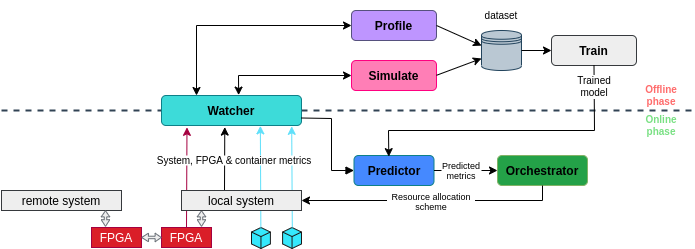

# Adrias
A predictive monitoring and orchestration tool for disaggregated memory systems




# Citation
If you use this repo, please cite our work:
```
@inproceedings{DBLP:conf/hpca/MasourosPGXS23,
  author       = {Dimosthenis Masouros and
                  Christian Pinto and
                  Michele Gazzetti and
                  Sotirios Xydis and
                  Dimitrios Soudris},
  title        = {Adrias: Interference-Aware Memory Orchestration for Disaggregated
                  Cloud Infrastructures},
  booktitle    = {{IEEE} International Symposium on High-Performance Computer Architecture,
                  {HPCA} 2023, Montreal, QC, Canada, February 25 - March 1, 2023},
  pages        = {855--869},
  publisher    = {{IEEE}},
  year         = {2023},
  url          = {https://doi.org/10.1109/HPCA56546.2023.10070939},
  doi          = {10.1109/HPCA56546.2023.10070939},
  timestamp    = {Wed, 29 Mar 2023 11:07:46 +0200},
  biburl       = {https://dblp.org/rec/conf/hpca/MasourosPGXS23.bib},
  bibsource    = {dblp computer science bibliography, https://dblp.org}
}
```
