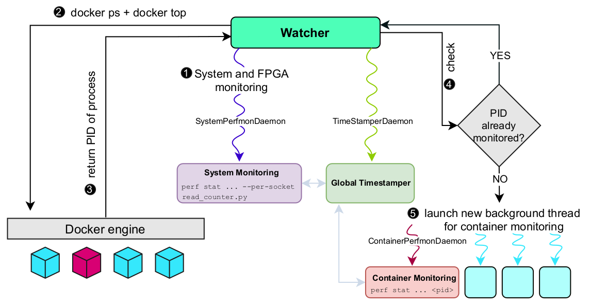

# Perf monitoring for docker container process

This is a monitoring tool for docker containers and system level metrics.

The overview of the tool is depicted in the Figure below:



### System-level monitoring

By default, the tool captures metrics for one socket (S0) also captures FPGA metrics (provided by Thymesisflow framework).

You can extend this functionality in the `daemons.py` file, inside the class `SystemPerfmonDaemon`.

### Container-level monitoring

For container level metrics, the tool currently captures only metrics for `redis-server`, `memcached`, `spark workers` and `stream`.

You can further expand the list in the `dockerinfo.py` file.

### Configuring monitored metrics and interval

You can configure these in the `config.py` file.

## Run

The tool requires `sudo` privileges (to gain access to perf events). In a terminal, just run
```bash
sudo python3 -u watcher.py
```

## Terminate

Just hit `Ctrl+C` and wait for the process to clean-up.